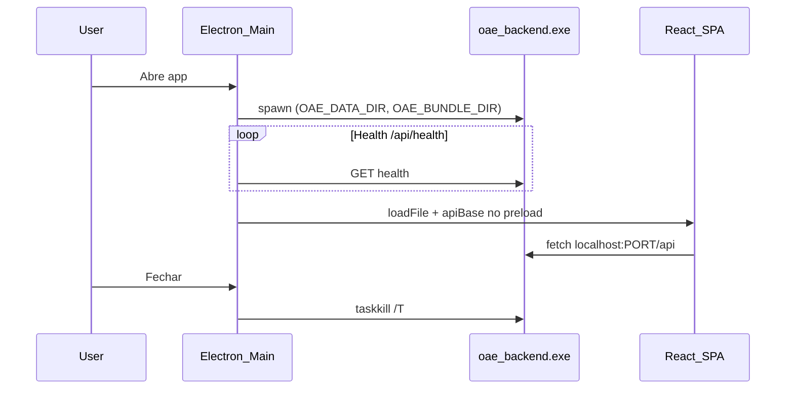

# Tutorial — Aplicativo Desktop Windows (Electron)

Guia completo para desenvolver, empacotar e distribuir o **OAE Report Generator** como aplicativo Windows instalável.

---

## 1. Estrutura do projeto

```
d:\relatorio\
├── backend/                 # API FastAPI + pipeline de relatórios
│   └── api/
│       ├── server.py        # App FastAPI (módulo compartilhado)
│       └── server_desktop.py # Entry point desktop (porta 8765+)
├── frontend/                # React + Vite
├── electron/                # Processo principal Electron
│   ├── main.ts
│   ├── preload.ts
│   ├── backend-manager.ts
│   ├── splash.html
│   └── error.html
├── desktop/assets/          # icon.ico, icon.png
├── pyinstaller/
│   └── oae-backend.spec     # PyInstaller onedir
├── scripts/
│   ├── build-backend.ps1
│   ├── build-desktop.ps1
│   ├── dev-desktop.ps1
│   └── create-desktop-icon.py
├── resources/backend/       # Saída PyInstaller (gitignored)
├── package.json             # Electron + electron-builder (raiz)
├── electron-builder.yml
└── TUTORIAL_DESKTOP.md      # Este arquivo
```

**Dados do usuário (produção):**

| Caminho | Conteúdo |
|---------|----------|
| `%APPDATA%\OAE Report Generator\data\` | workspaces, rules editáveis |
| `%APPDATA%\OAE Report Generator\logs\` | electron.log, backend.log, startup.log |

---

## 2. Desenvolvimento desktop

### Pré-requisitos

- Python 3.12+ com dependências: `pip install -e .`
- Node.js 20+
- `npm install` na raiz e em `frontend/`

### Modo dev (3 processos)

```powershell
# Terminal 1 — backend desktop
$env:OAE_DATA_DIR = "$env:LOCALAPPDATA\OAE Report Generator\dev-data"
python -m backend.api.server_desktop

# Terminal 2 — frontend
cd frontend
npm run dev

# Terminal 3 — Electron
cd ..
npm run electron:dev
```

**Atalho:** abre backend e Vite em janelas separadas e inicia o Electron:

```powershell
npm run desktop:dev
```

O renderer carrega `http://localhost:5173`. A API usa `http://127.0.0.1:8765/api` (via preload).

---

## 3. Build completo (frontend + backend + Electron)

```powershell
npm run desktop:build
```

Etapas executadas por `scripts/build-desktop.ps1`:

1. `frontend/npm run build` — SPA com `base: './'`
2. `scripts/build-backend.ps1` — PyInstaller onedir → `resources/backend/oae-backend/`
3. `npm run electron:compile` — TypeScript → `electron/dist/`

---

## 4. PyInstaller onedir (passo a passo)

### 4.1 Template Word

O arquivo `backend/templates/report_template.docx` deve existir no repositório antes do build PyInstaller.

### 4.2 Instalar PyInstaller

```powershell
pip install pyinstaller
```

### 4.3 Executar build

```powershell
npm run backend:bundle
# ou
powershell -File scripts/build-backend.ps1
```

**Saída:** `resources/backend/oae-backend/oae-backend.exe` (+ DLLs e `_internal`).

### 4.4 Variáveis de ambiente (runtime)

| Variável | Descrição |
|----------|-----------|
| `OAE_DATA_DIR` | AppData gravável (workspaces, rules) |
| `OAE_BUNDLE_DIR` | Pasta do exe PyInstaller (read-only) |
| `OAE_PORT` | Porta inicial (padrão 8765) |
| `LOG_LEVEL` | INFO, DEBUG, etc. |

O Electron define essas variáveis ao iniciar o backend.

---

## 5. Gerar instalador NSIS

Após `npm run desktop:build`:

```powershell
npm run desktop:dist
```

**Artefatos em `dist-desktop/`:**

- `OAE Report Generator-0.1.0-win-x64.exe` — instalador NSIS
- `OAE Report Generator-0.1.0-portable.exe` — versão portátil

Configuração: `electron-builder.yml` (NSIS + portable, ícone, atalhos).

---

## 6. Trocar o ícone

1. Substitua ou gere ícones:

```powershell
python scripts/create-desktop-icon.py
```

2. Arquivos esperados:
   - `desktop/assets/icon.ico` (Windows)
   - `desktop/assets/icon.png` (fonte)

3. Rebuild: `npm run desktop:dist`

---

## 7. Atualizar versão

Alinhe a versão nestes três arquivos:

| Arquivo | Campo |
|---------|-------|
| `pyproject.toml` | `[project] version` |
| `frontend/package.json` | `version` |
| `package.json` (raiz) | `version` |

Depois execute o pipeline completo:

```powershell
npm run desktop:dist
```

---

## 8. Distribuir

| Formato | Uso |
|---------|-----|
| **NSIS (.exe)** | Instalação padrão, atalho na área de trabalho, desinstalador |
| **Portable (.exe)** | USB / sem instalação; dados ainda em AppData |

**Não é necessário** Python ou Node no PC do usuário final.

**Assinatura de código (Authenticode):** não incluída na v1 — recomendada para reduzir alertas de antivírus.

---

## 9. Debug Electron

- DevTools: abertos automaticamente em `npm run electron:dev`
- Logs: `%APPDATA%\OAE Report Generator\logs\electron.log`
- Variável: `$env:ELECTRON_ENABLE_LOGGING = "1"`
- Reiniciar renderer: `Ctrl+R` (somente dev)
- Fullscreen: `F11`
- Sair: `Ctrl+Q`

---

## 10. Debug backend

- Log: `%APPDATA%\OAE Report Generator\data\logs\backend.log` (desktop)
- Porta escolhida: `%APPDATA%\OAE Report Generator\data\backend.port`
- Testes isolados:

```powershell
$env:OAE_DATA_DIR = "$env:TEMP\oae-test-data"
python -m pytest backend/tests -q
```

- Servidor manual:

```powershell
$env:OAE_DATA_DIR = "$env:LOCALAPPDATA\OAE Report Generator\dev-data"
python -m backend.api.server_desktop
```

---

## 11. Troubleshooting

| Problema | Solução |
|----------|---------|
| Porta ocupada | Backend tenta 8765–8774; feche instâncias antigas no Gerenciador de Tarefas |
| Assinatura / symlink winCodeSign | Defina `$env:CSC_IDENTITY_AUTO_DISCOVERY='false'` antes do build (ja no `scripts/dist-desktop.ps1`) |
| Template ausente | Garanta `backend/templates/report_template.docx` no repositório antes do PyInstaller |
| CORS no desktop | Confirme `OAE_DATA_DIR` ou `OAE_DESKTOP=1` |
| Tela de erro ao abrir | Veja `backend.log` e `startup.log` |
| Upload de fotos falha | Use diálogo nativo (Electron); verifique IPC no preload |
| Sidebar ok, área principal vazia | Verifique se o app usa `HashRouter` (padrão desktop); rebuild com `npm run desktop:dist` |
| Campos não aceitam digitação/clique | Região `-webkit-app-region: drag` bloqueia inputs no Electron; versão corrigida usa `no-drag` nos campos e remove drag no desktop |
| Fotos não aparecem na validação | URLs `/api/...` não funcionam em `file://`; versão corrigida usa URL absoluta do backend e upload direto da pasta pelo Electron |
| Lista de anomalias cortada | Altura da virtualização corrigida (`rowHeight` e `min-h-0` no layout flex) |
| Frontend em branco (prod) | Rebuild com `base: './'` e `loadFile` do `frontend/dist/index.html` |

---

## 12. Árvore pós-build

```
dist-desktop/
├── OAE Report Generator-0.1.0-win-x64.exe
└── OAE Report Generator-0.1.0-portable.exe

resources/backend/oae-backend/
├── oae-backend.exe
└── _internal/          # dependências Python

frontend/dist/          # SPA empacotada
electron/dist/          # main.js, preload.js, splash.html
```

---

## 13. Fluxo de inicialização



---

## 14. Pipeline CI / local completo

```powershell
# 1. Dependências
pip install -e ".[dev]"
pip install pyinstaller
cd frontend; npm ci; cd ..
npm ci

# 2. Ícone
python scripts/create-desktop-icon.py

# 3. Testes
python -m pytest backend/tests -q

# 4. Build
npm run desktop:build

# 5. Instalador
npm run desktop:dist
```

---

## 15. Configurar antes de usar (Gerenciamento)

Abra **Gerenciamento** na barra lateral — configuração **global** (aplica-se a todas as obras), gravada em `%APPDATA%\OAE Report Generator\data\rules\` no desktop.

| Aba | O que preparar |
|-----|----------------|
| **Dados de entrada** | Modelo de colunas Excel; teste de planilha `.xlsx`; siglas LB/VL/P na legenda |
| **Catálogo** | Bases e modificadores — liga o texto da coluna Anomalia às regras de descrição |
| **Textos** | Templates de título/localização; regras `descriptions.yaml` com preview no servidor |
| **Fotos e RSP** | Ordem técnica (leitura); sufixo de direção e legenda de figura |
| **Documento** | Template Word padrão ou personalizado |

**Exportar / Importar** — backup JSON com todas as regras. **Checklist** no topo indica itens pendentes antes da primeira análise.

A rota antiga `/template` redireciona para Gerenciamento → Documento.

---

## 16. Troubleshooting — fotos e miniaturas

| Sintoma | Causa provável | O que fazer |
|---------|----------------|-------------|
| **Imagens encontradas = 0** após análise | Planilha sem correspondência com nomes/tokens das fotos, ou pasta sem `.jpg`/`.jpeg`/`.png` | Confira códigos `Cam inicial` / `nr_foto` vs. nomes dos arquivos; reenvie a pasta de fotos |
| Upload OK mas validação sem miniatura | Fotos só em subpastas (cenário comum no desktop) | Versões recentes indexam subpastas recursivamente; gere novo instalador com `npm run desktop:dist` |
| Mensagem *Nenhuma imagem encontrada na pasta enviada* | Pasta vazia ou só com formatos não suportados | Selecione a pasta raiz que contém as subpastas da obra (não apenas uma subpasta vazia) |

Após análise, confira em `%APPDATA%\OAE Report Generator\data\workspaces\{id}\input\images\` se os arquivos estão em subpastas e se `preview\` recebe cópias.

---

## 17. Checklist pré-release

- [ ] Versão atualizada em `pyproject.toml`, `frontend/package.json`, `package.json`
- [ ] `report_template.docx` presente antes do PyInstaller
- [ ] `npm run desktop:build` sem erros
- [ ] Instalador testado em máquina **sem** Python/Node no PATH
- [ ] Health check e splash
- [ ] Upload Excel + pasta de imagens (diálogo nativo)
- [ ] Análise, validação, revisão de fotos
- [ ] Geração Word + download/abrir relatório
- [ ] Gerenciamento (editar rules → persistem em AppData)
- [ ] Offline (sem internet)
- [ ] Fechar app → `oae-backend.exe` encerrado (Gerenciador de Tarefas)
- [ ] Segunda abertura → workspaces e regras preservados
- [ ] Logs gerados em `%APPDATA%\OAE Report Generator\logs\`

---

## 18. Referência rápida de comandos

| Comando | Ação |
|---------|------|
| `npm run desktop:dev` | Dev com backend + Vite + Electron |
| `npm run electron:dev` | Só Electron (backend/Vite já rodando) |
| `npm run backend:bundle` | PyInstaller onedir |
| `npm run desktop:build` | Build completo |
| `npm run desktop:dist` | Gera instalador Windows |
| `npm run desktop:smoke` | Smoke tests automatizados |
